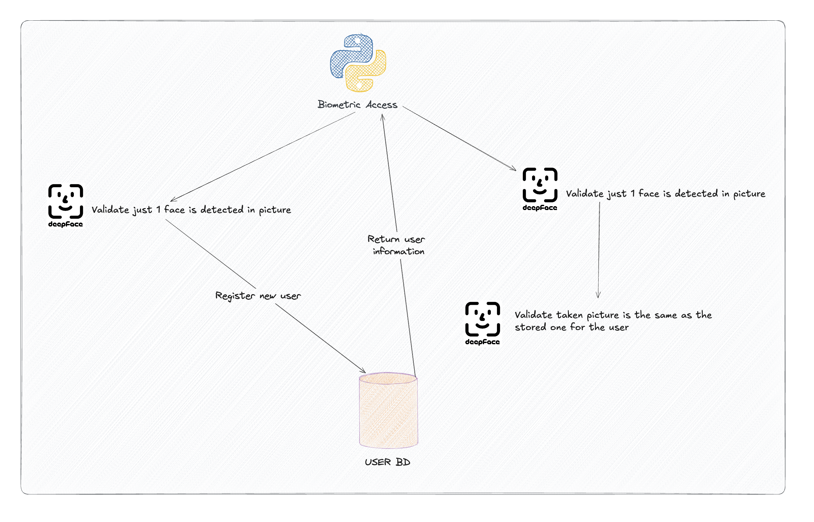

# Biometric Authentication System



## Prerequisites

- Python 3.6 or higher
- NodeJS (NPM)
- Docker (optional if want contenerized version for backend)

# Backend

## Environment Requirements

The project requires the following dependencies, which are specified in the `requirements.txt` file:

- Flask
- deepface
- Pillow
- numpy
- pymongo
- dnspython
- flask-cors

## Setup and Execution

### Step 1: Set Up the Environment

Create a virtual environment to manage dependencies.

```sh
python -m venv venv
source venv/bin/activate  # On Windows use `venv\Scripts\activate`
```

### Step 2: Set Up the Environment Variables

Create a `.env` file in the root directory of the project and add the following environment variables:

```sh
MONGO_URI=<Your mongodb url>
```

### Step 3: Install Dependencies

First, install the required dependencies using `pip`.

```sh
pip install -r requirements.txt
```

### Step 4: Run the Application

To run the application, execute the following command:

```sh
python app.py
```

The application will be accessible at `http://localhost:80`.

# Front end

### Step 1 : Install dependencies

To install all dependencies move to the front end project and:

```sh
npm install
```

### Step 2 : Run the application

To run the application run the following:

```sh
npm run dev
```

The application will be accessible at `http://localhost:5173/`.
